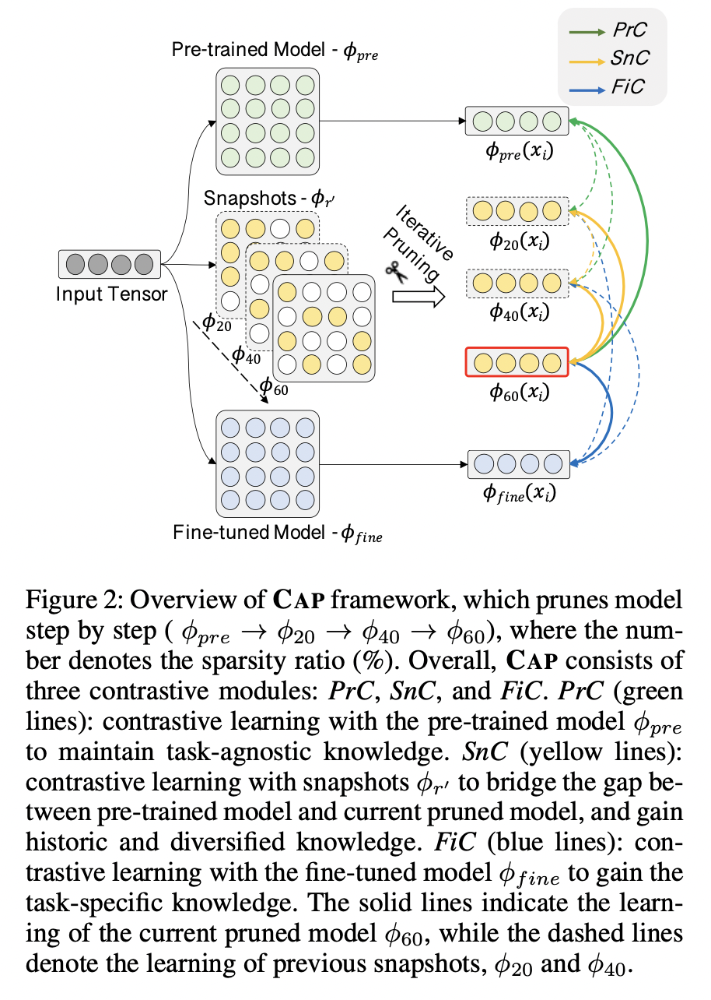

# ContrastivePruning

Source code for AAAI 2022 paper: From Dense to Sparse: Contrastive Pruning for Better Pre-trained Language Model Compression.

Coming soon!


## 🔥 Introduction

Most model pruning approaches only consider task-specific knowledge towards downstream tasks, but ignore the essential task-agnostic knowledge.
Therefore, we propose ContrAstive Pruning (*CAP*), a general pruning framework under the pre-training and fine-tuning paradigm, which aims at maintaining both task-specific and task-agnostic knowledge during pruning.
*CAP* is designed as a general framework, compatible with both structured and unstructured pruning. 
Unified in contrastive learning, *CAP* encourage the pruned model to learn from the pre-trained model, the snapshots (intermediate models during pruning), and the fine-tuned model, through three contrastive modules, *PrC*, *SnC*, and *FiC*, respectively.
You can refer to our [paper]() for more details.

<div align=center>

</div>


## 🚀 How to use our code?

### 💾 Data 

For unstructured pruning, you have to download the *GLUE* and *SQuAD v1.1* data and put them into the [data](./data) folder.
We also provide the data [here](https://drive.google.com/file/d/1f09xjz0SraMmwuZmMHi19FcKy_0EWPno/view?usp=sharing).

### 🥷 Preparation

Before training, you have to first train a teacher model and put it into the [teacher](./teacher) folder, which is used in our *FiC* module and knowledge distillation. 
Using the scripts provided by Huggingface, you can easily train a model for [GLUE](https://github.com/huggingface/transformers/tree/master/examples/pytorch/text-classification) and [SQuAD v1.1](https://github.com/huggingface/transformers/tree/master/examples/pytorch/question-answering).

### 🏋🏻‍♂️ Structured and Unstructured Pruning

We provide codes for both [structured pruning](./StructuredPruning) and [unstructured pruning](./UnstructuredPruning) based on our proposed Contrastive Pruning framework.

## 🌝 Citation

If you use this work or code, please kindly cite the following paper:

```bib
@inproceedings{xu-etal-2021-contrastivepruning,
    title = "From Dense to Sparse: Contrastive Pruning for Better Pre-trained Language Model Compression",
    author = "Runxin Xu and
    Fuli Luo and Chengyu Wang and
    Baobao Chang and Jun Huang and
    Songfang Huang and Fei Huang",
    booktitle = "Thirty-Sixth {AAAI} Conference on Artificial Intelligence (AAAI)",
    year = "2022"
}
```
