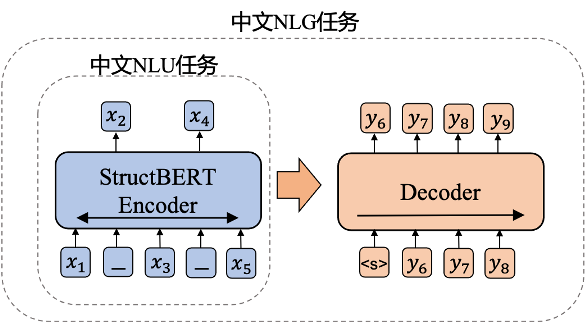
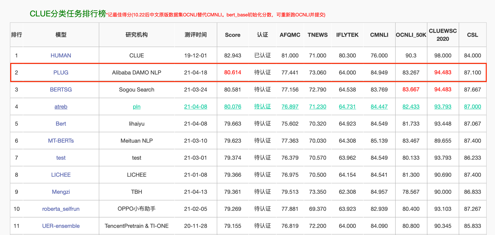

# PLUG: Pre-training for Language Understanding and Generation

## Introduction
PLUG is a large-scale chinese pre-training model for language understanding and generation. PLUG has 27 billion parameters.
The training of PLUG is two-stage, the first stage is a 24-layer [StructBERT](https://arxiv.org/abs/1908.04577) encoder, and the second stage is a 24-6-layer [PALM](https://arxiv.org/pdf/2004.07159.pdf?fbclid=IwAR0BNl1IzR5bhcuEbyfNw2UN7MApHFoFP3BN40FKkW8x3bqolK_HilU293I) encoder-decoder.


## Pre-trained model download
|Model | Description | #params | Download |
|------------------------|-------------------------------------------|------|------|
|PLUG |chinese PLUG  | 27B | [Apply for download](https://www.alice-mind.com/portal#/) |

## Results
#### Finetune
[CLUE classification benchmark](https://www.cluebenchmarks.com/classification.html), results from 2021/04/20


Finetine results on Question Generation Tasks
|Model|Metric|[KBQG](https://github.com/nanduan/NLPCC-KBQA)|[DuReaderQG](https://arxiv.org/abs/1711.05073)|[DuReader-Robust](https://arxiv.org/abs/2004.11142)|
|-----|-----|-------|--------|----|
|plug.zh|BLEU-4|66.30|49.20|42.83|


#### Zero-shot cases
* Novel Generation


* Scientific Literature Generation


* Common Sense Q&A


* Zero-shot Classification


## Example usage
Device requirements for inference: single node, 8 16G V100 GPUs, with at least 9 CPU cores.

```shell
git clone https://github.com/alibaba/AliceMind.git
cd AliceMind/PLUG

# Download model: About 55 GB after unzip.
[Apply for download](https://www.alice-mind.com/portal#/)

# inference
CUDA_VISIBLE_DEVICES=0,1,2,3,4,5,6,7 python -m torch.distributed.launch --nproc_per_node=8 predict.py
```
For information on PLUG finetune, you can visit https://github.com/alibaba/AliceMind/tree/main/sofa

## 免责声明
针对基于本模型由用户直接或间接生成的内容，我们不对基于模型产生、生成内容的合规性承担责任。

您在此承诺：

1、您会严格落实法律法规、部门规章等相关文件的全部要求（包括但不限于备案、标识等），不会使用模型能力从事任何违反法律法规或公序良俗的行为，不会使用模型能力生成任何涉及恐怖、暴力、色情等违反法律要求的信息，或为上述行为提供帮助。

2、您使用模型能力而取得的任何产出或成果（包括但不限于音频、视频、文本文件等），应按照法律法规、部门规章等相关文件的要求进行合法使用。

3、您承诺您在使用模型能力过程中提供的素材等数据，是您通过合法途径取得并获得充分授权对其进行使用的。您承诺使用的任何素材、相关数据、对模型能力的使用及使用能力所产生的任何成果，均未侵犯任何第三方的合法权益。如有第三方基于侵犯著作权、侵犯第三人之权益或违反中国法律法规或其他适用的法律等原因而向提起索赔、诉讼或可能向提起诉讼，则您应赔偿因此承担的所有费用或所有损失。

## Citation
If you use our work, please cite the follow papers:
```
@article{wang2019structbert,
  title={Structbert: Incorporating language structures into pre-training for deep language understanding},
  author={Wang, Wei and Bi, Bin and Yan, Ming and Wu, Chen and Bao, Zuyi and Xia, Jiangnan and Peng, Liwei and Si, Luo},
  journal={arXiv preprint arXiv:1908.04577},
  year={2019}
}

@inproceedings{bi-etal-2020-palm,
    title = "{PALM}: Pre-training an Autoencoding{\&}Autoregressive Language Model for Context-conditioned Generation",
    author = "Bi, Bin and Li, Chenliang and Wu, Chen and Yan, Ming and
      Wang, Wei and Huang, Songfang and Huang, Fei and Si, Luo",
    booktitle = "Proceedings of the 2020 Conference on Empirical Methods in Natural Language Processing (EMNLP)",
    year = "2020",
    publisher = "Association for Computational Linguistics",
    url = "https://www.aclweb.org/anthology/2020.emnlp-main.700",
}
```
