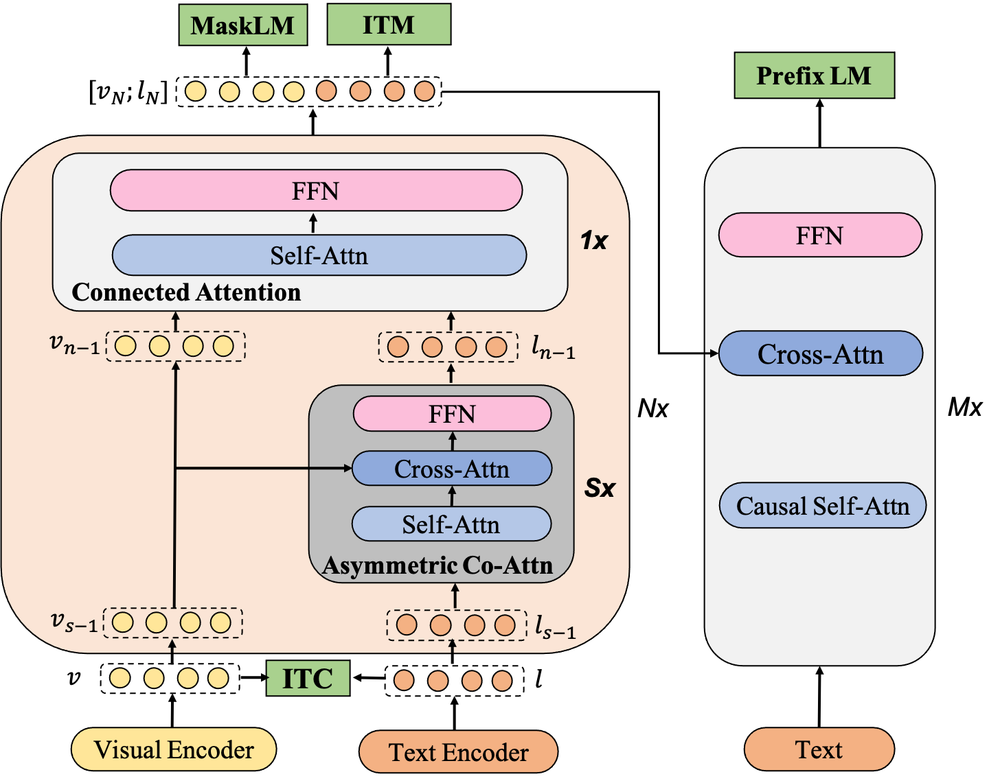

# mPLUG: Effective and Efficient Vision-Language Learning by Cross-modal Skip-connections.

[https://arxiv.org/abs/2205.12005](https://arxiv.org/abs/2205.12005)


## Introduction
We presents mPLUG, a new vision-language foundation model for both cross-modal understanding and generation. Most existing pre-trained models suffer from inefficiency and linguistic signal overwhelmed by long visual sequences in cross modal alignment. To address both problems, mPLUG introduces an effective and efficient vision-language architecture with novel cross modal skip-connections. mPLUG achieves state-of-the-art results on a wide range of vision language downstream tasks, including image captioning, image-text retrieval, visual grounding and visual question answering.

 


## News

* 2022.8.28: Released mPLUG downstream tasks!


## Pre-trained models and datasets

* Pre-trained models

 
For VQA and image captioning tasks, we do an additional continue pre-training on 4M image-text pairs based mplug.en.large to get mplug.en.large.v2.
 
 
|Model | Visual Backbone | Text Enc Layers | Fusion Layers | Text Dec Layers | #params | Download |
|------------------------|-------------------------------------------|------|------|------|------|-----|
|mplug.en.base | [vit-b-16](https://alice-open.oss-cn-zhangjiakou.aliyuncs.com/mPLUG/ViT-B-16.tar) | 6 | 6 | 12 | 350M | [mplug.en.base](https://alice-open.oss-cn-zhangjiakou.aliyuncs.com/mPLUG/mplug_base.pth) |
|mplug.en.large | [vit-l-14](https://alice-open.oss-cn-zhangjiakou.aliyuncs.com/mPLUG/ViT-L-14.tar) | 6 | 6 | 12 | 600M | [mplug.en.large](https://alice-open.oss-cn-zhangjiakou.aliyuncs.com/mPLUG/mplug_large.pth) |
|mplug.en.large.v2 | [vit-l-14](https://alice-open.oss-cn-zhangjiakou.aliyuncs.com/mPLUG/ViT-L-14.tar) | 6 | 6 | 12 | 600M | [mplug.en.large.v2](https://alice-open.oss-cn-zhangjiakou.aliyuncs.com/mPLUG/mplug_large_v2.pth) |
|mplug.en.huge | vit-l-14 | 24 | 6 | 12 | 1.1B | comming soon |
                                                                     

* Pre-train Datasets

                                                                        
| | COCO | VG | SBU | CC3M | CC13M |
|------------------------|-------------------------------------------|------|------|------|------|
|image | 113K | 100K | 860K | 3M | 10M | 
|text | 567K | 769K | 860K | 3M | 10M |


## Results
- Image-text
<table>
<thead>
  <tr align="center">
    <th>Task</th>
    <th>VQA</th>
    <th>Image Captioning</th>
    <th colspan="2">Retrieval</th>
    <th colspan="3">Referring Expression&nbsp;&nbsp;&nbsp;Comprehension</th>
    <th colspan="2">Visual Entailment</th>
  </tr>
</thead>
<tbody>
  <tr align="center">
    <td>Dataset</td>
    <td>VQA v2</td>
    <td>COCO</td>
    <td>MSCOCO</td>
    <td>Flickr30K</td>
    <td>RefCOCO</td>
    <td>RefCOCO+</td>
    <td>RefCOCOg</td>
    <td>SNLI-VE</td>
    <td>NLVR2</td>
  </tr>
  <tr align="center">
    <td>Split</td>
    <td>test-dev/test-std</td>
    <td>Karpathy&nbsp;test (CE/CIDEr)</td>
    <td>5k test (TR/IR)</td>
    <td>1k test (TR/IR)</td>
    <td>val/test-a/test-b</td>
    <td>val/test-a/test-b</td>
    <td>val-u/test-u</td>
    <td>val/test</td>
    <td>dev/test-P</td>
  </tr>
  <tr align="center">
    <td>Metric</td>
    <td>Acc.</td>
    <td>CIDEr</td>
    <td>R@1</td>
    <td>R@1</td>
    <td colspan="3">Acc.</td>
    <td>Acc.</td>
    <td>Acc.</td>
  </tr>
  <tr align="center">
    <td>mPLUG<sub>Base</td>
    <td>79.79/79.98</td>
    <td>137.5/150.4</td>
    <td>-/-</td>
    <td>-/-</td>
    <td>-/-</td>
    <td>-/-</td>
    <td>-/-</td>
    <td>-/-</td>
    <td>-/-</td>
  </tr>
  <tr align="center">
    <td>mPLUG<sub>Large</td>
    <td>81.27/81.26</td>
    <td>141.0/155.1</td>
    <td>82.8/65.8</td>
    <td>97.6/88.4</td>
    <td>92.40/94.51/88.42</td>
    <td>86.02/90.17 / 78.17</td>
    <td>85.88/86.42</td>
    <td>89.45/89.29</td>
    <td>84.58/84.95</td>
  </tr>
  <tr align="center">
    <td>mPLUG<sub>Huge</td>
    <td>82.27/82.41</td>
    <td>142.3/158.7</td>
    <td>-/-</td>
    <td>-/-</td>
    <td>-/-/-</td>
    <td>-/-/-</td>
    <td>-/-</td>
    <td>-/-</td>
    <td>-/-/-</td>
  </tr>
</tbody>
</table>

- Video-text

<table>
<thead>
  <tr align="center">
    <th>Task</th>
    <th>Video Retrieval</th>
    <th colspan="2">Video QA</th>
    <th>Video Captioning</th>
  </tr>
</thead>
<tbody>
  <tr align="center">
    <td>Dataset</td>
    <td>MSRVTT</td>
    <td>MSRVTT-QA</td>
    <td>MSVD-QA</td>
    <td>VATEX</td>
  </tr>
  <tr align="center">
    <td>Split</td>
    <td>test</td>
    <td>test</td>
    <td>test</td>
    <td>test(CE)</td>
  </tr>
  <tr align="center">
    <td>Metric</td>
    <td>R@1</td>
    <td>Acc.</td>
    <td>Acc.</td>
    <td>CIDEr</td>
  </tr>
  <tr align="center">
    <td>mPLUG</td>
    <td>38.1</td>
    <td>21.1</td>
    <td>37.2</td>
    <td>42.0</td>
  </tr>
</tbody>
</table>


## Requirements
* [PyTorch](https://pytorch.org/) version >= 1.11.0

* Install other libraries via
```
pip install -r requirements.txt
```


## Pre-training


Comming soon.


## Fine-tuning

[Download json files of downstream tasks](https://alice-open.oss-cn-zhangjiakou.aliyuncs.com/mPLUG/data.tar)

### Visual Question Answering

1. Download VQA v2 dataset and Visual Genome dataset from the original websites [VQA 2.0](https://eval.ai/web/challenges/challenge-page/830/leaderboard/2278).
2. Download and extract the provided dataset json files.
3. In configs/vqa_mplug_base.yaml, set the paths for the json files and the image paths.
4. Finetune the pre-trained mplug_base or large model using 8 A100 GPUs:
<pre>sh scripts/vqa_mplug_base.sh</pre> 
<pre>sh scripts/vqa_mplug_large.sh</pre>                                             
5. Evaluate the result using the official evaluation server.
       
                                                                                          
### Image Captioning
     
                                                                                          
1. Download COCO Caption dataset from the original websites.
2. Download and extract the provided dataset json files.
3. Download language evalution tool([language_evalution](https://alice-open.oss-cn-zhangjiakou.aliyuncs.com/mPLUG/language_evaluation.tar)).
4. In configs/caption_mplug_base.yaml, set the paths for the json files and the image paths.
5. Finetune the pre-trained mplug_base or large model using 8 A100 GPUs:
<pre>sh scripts/caption_mplug_base.sh</pre> 
<pre>sh scripts/caption_mplug_large.sh</pre>  

                                                                                          
### Image-text Retrieval
1. Download MSCOCO or Flickr30k datasets from the original websites.
2. Download and extract the provided dataset json files.
3. In configs/retrieval_flickr30k_mplug_large.yaml or configs/retrieval_coco_mplug_large.yaml, set the paths for the json files and the image path.
4. Finetune the pre-trained checkpoint using 8 A100 GPUs:
<pre>sh scripts/retrieval_flickr30k_mplug_large.sh</pre> 
<pre>sh scripts/retrieval_coco_mplug_large.sh</pre>

### Visual Grounding
1. Download RefCOCO datasets from the original websites.
2. Download and extract the provided dataset json files.
3. In configs/grounding_mplug_large.yaml, set the paths for the json files and the image path. Data preparation can follow [TransVG](https://github.com/djiajunustc/TransVG)
4. Finetune the pre-trained checkpoint using 8 A100 GPUs:
<pre> sh scripts/grounding_mplug_base.sh </pre>

### Zero-shot Video-text Retrieval
1. Download MSRVTT datasets from the original websites.
2. In configs/retrieval_msrvtt_mplug_large.yaml, set the paths for the json files and the video paths.
3. To perform zero-shot evaluation, run：
<pre>sh scripts/retrieval_msrvtt_mplug_large.sh</pre> 

### Zero-shot Video Question Answering
1. Download MSRVTT-QA datasets from the original websites.
2. In configs/videoqa_msrvtt_mplug_base.yaml, set the paths for the json files and the video paths.
3. To perform zero-shot evaluation, run：
<pre>sh scripts/videoqa_msrvtt_mplug_base.sh</pre> 

### Zero-shot Video Captioning
1. Download VATEX datasets from the original websites.
2. In configs/videocap_vatex_mplug_large.yaml, set the paths for the json files and the video paths.
3. To perform zero-shot evaluation, run：
<pre>sh scripts/videocap_vatex_mplug_large.sh</pre> 


## Citation
If you use our work, please cite:
```
@article{li2022mplug,
  title={mPLUG: Effective and Efficient Vision-Language Learning by Cross-modal Skip-connections},
  author={Li, Chenliang and Xu, Haiyang and Tian, Junfeng and Wang, Wei and Yan, Ming and Bi, Bin and Ye, Jiabo and Chen, Hehong and Xu, Guohai and Cao, Zheng and others},
  journal={arXiv preprint arXiv:2205.12005},
  year={2022}
}
```
## Acknowledgement

The implementation of mPLUG relies on resources from [ALBEF](https://github.com/salesforce/ALBEF), [BLIP](https://github.com/salesforce/BLIP), and [timm](https://github.com/rwightman/pytorch-image-models/tree/master/timm). We thank the original authors for their open-sourcing.

